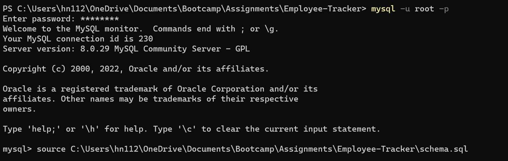
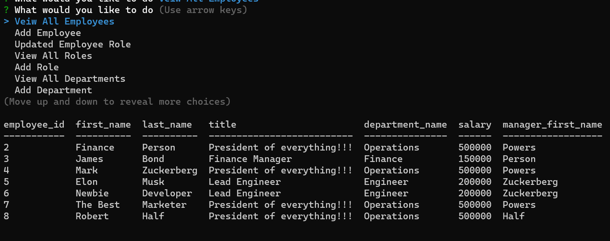

# Employee-Tracker

<div id="top"></div>

<br />
<div align="center">


<h3 align="center">Employee Tracker</h3>

  <p align="center">
    SQL based, Command Prompt employee tracker
    <br />
  </p>
</div>

<details>
  <summary>Table of Contents</summary>
  <ol>
    <li><a href="#about-the-project">About The Project</a></li>
    <li><a href="#tools">Tools</a></li>
    <li><a href="#instructions">Instructions</a></li>
    <li><a href="#usage">Usage</a></li>
    <li><a href="#license">License</a></li>
    <li><a href="#contact">Contact</a></li>
  </ol>
</details>

## About The Project

The motivation behind this project is to create an SQL-based employee tracking database. 

The SQL database allows users to run reports as well as modify and delete data via the command prompt. The application utilizes javascript including node.js and Inquire.js to prompt and fulfil user requests. 

<p align="right">(<a href="#top">back to top</a>)</p>

### Tools

* JavaScript
* SQL
* Node.js


<p align="right">(<a href="#top">back to top</a>)</p>

## Instructions

Please follow the instructions below to install and use the employee tracker application: 

- You will need to download the repository files to your local machine. 
- Type the two following commands into the command prompt within the root directory of the repository to download the npm module:
```
npm init -y 
```
```
npm install
``` 
- This application requires MySQL. You will need to run the schema.sql file using MySQL to create the employees database. The seeds.sql file is used to prepopulate your database and is optional. You can download MySQL <a href = 'https://dev.mysql.com/downloads/installer/'> here </a>. Once you have MySQL installed, run the following command lines wihtin the root directory of your repository to create the employees database.
```
mysql -u root -p
```
```
<Enter your password>
```
```
source <enter the directory of your schema.sql file>
```



```
optional: source <enter the directory of your seed.sql file>
```
```
quit
```


- Then type the following into the command prompt to run the employee tracking application.
```
npm start
```
- You will then be presented with a series of options to view reports, make modifications as well as delete items from the employees database. You can select exit to exit the application at any time.


## Usage

Refer to video linked below for a working demonstration of the application:

[](https://drive.google.com/file/d/1ozgM0iFh8nO7bt6GAUExz6ymFJyvkB90/view?usp=sharing)


<p align="right">(<a href="#top">back to top</a>)</p>

## License

[](https://opensource.org/licenses/MIT)
<br>Distributed under the MIT License. See `LICENSE.txt` for more information.

<p align="right">(<a href="#top">back to top</a>)</p>

## Contact

Henry Nguyen -  hln11244@gmail.com

Repository Link: [https://github.com/henry11244/Employee-Tracker](https://github.com/henry11244/Employee-Tracker)

linkedIn: https://www.linkedin.com/in/henry11244/

<p align="right">(<a href="#top">back to top</a>)</p>


